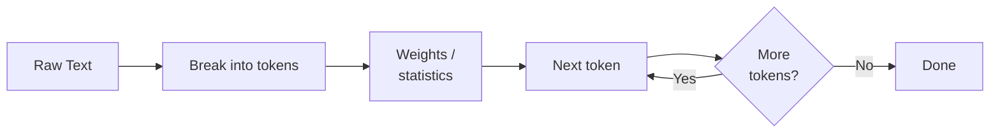
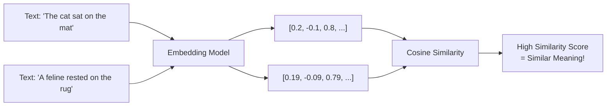
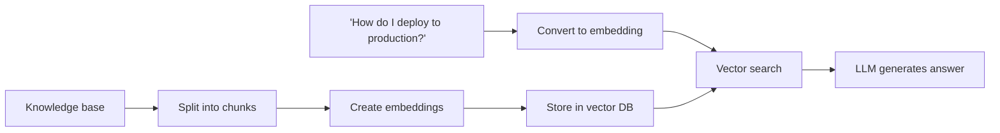

## Part 1: Foundational Concepts

### How LLMs Work Under the Hood

#### Key Building Blocks

**🧩 Tokens**

- The "words" that LLMs understand
- ~4 characters = 1 token
- Example: "Hello world!" = 3 tokens

**🧠 Weights**

- The "knowledge" stored in the model
- GPT-4 has ~1.7 trillion parameters
- Think of them as tiny pieces of learned information

**🎯 Prompt Engineering**

- The art of asking LLMs the right questions
- Better prompts = better answers

Deep Dive into LLMs by Andrej Karpathy: https://www.youtube.com/watch?v=7xTGNNLPyMI

**What LLMs Excel At:**

- ✅ Text generation and completion
- ✅ Pattern recognition

**What LLMs Struggle With:**

- ❌ Factual accuracy (hallucinations)
- ❌ Mathematical precision
- ❌ Consistent reasoning

### Embeddings and Semantic Search

Q: Why Embeddings Matter?

A: Semantic Search

### RAG (Retrieval-Augmented Generation) Pipeline

#### Why RAG is Powerful

**Without RAG:**

- ❌ LLM: "I don't have information about your specific deployment process"
- ❌ Outdated information from training data
- ❌ Generic answers

**With RAG:**

- ✅ LLM: "Based on your deployment guide, here are the exact steps..."
- ✅ Up-to-date information from your docs
- ✅ Company-specific answers
